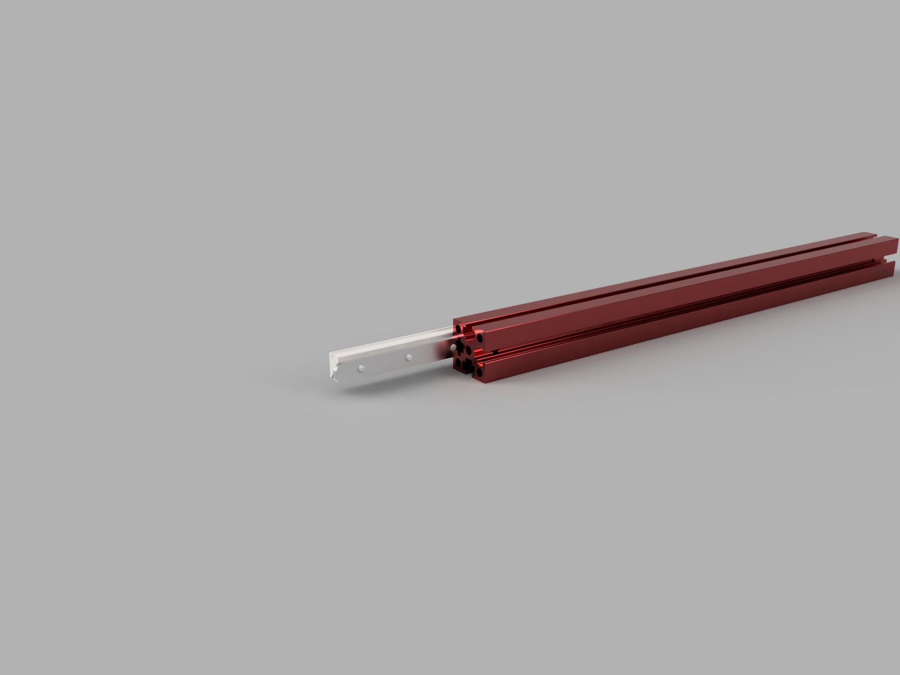

# V0 Nuttrap Replacements

These lasercut pieces are for getting rid of the annoying M2 nuttraps used in the v0 printers. It has M2 (you need to tap them after laser cutting) screws in MGN7 spacing. I used 1.5mm aluminium. Only stripped 1 hole, if worried, use steel but keep in mind steel is heavier.
