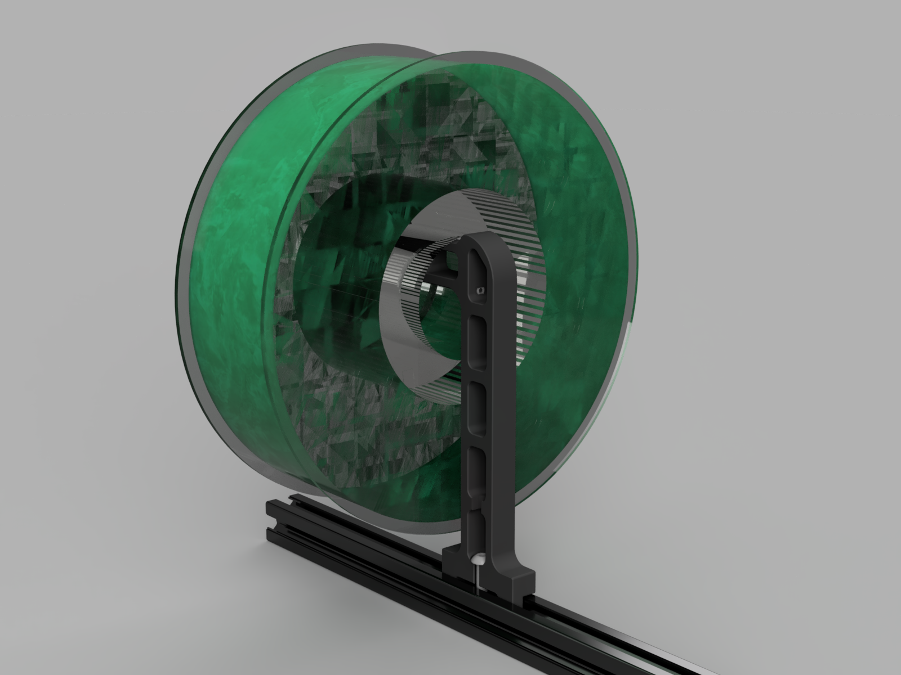

This is a modification to the stock v2.4 spool holder. In my setup the side-mounted stock spool holder hit the walls of a cabinet so this was designed to combat that.

Still uses the same M5 screw with t-nut mounting. You still need PTFE tubing. Works with the stock reverse bowden mount.
