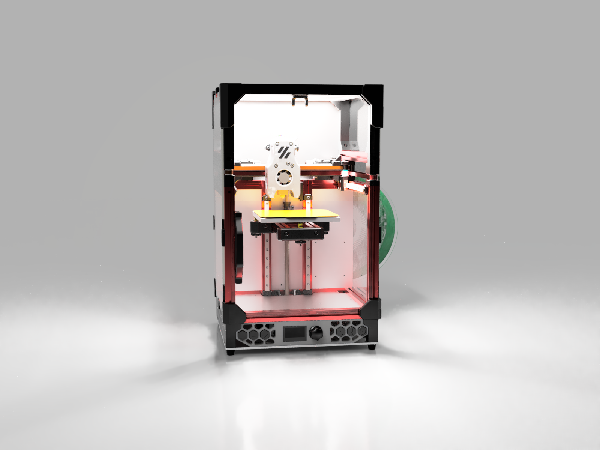

# V0.1 Tophat Mod

This is my new custom tophat design. It is a square shaped extension on the top using 3D printed 1515 parts (extrusion sized). Also includes LED mounting and a camera mount for a cheap [Aliexpress](https://s.click.aliexpress.com/e/_9xBGzb) webcam ([Amazon](https://amzn.to/2YGUBq3)). Requires larger acrylic panels and other laser cut aluminium panels.

Laser cut rear panel is 3mm thick. (I used aluminium)

Laser cut top & LED panels are 1.5mm thick. (I used aluminium for top, stainless steel for LED for reflectivity)

LED cover frosted acrylic panel is 3mm thick and 199.8x199.8mm. (200x200 with tolerances)

Side panels and door (acrylic) panels are 3mm thick and 212x330mm. You need 3 of these.

You will need to drill acrylic for the front door!! [Video Guide](https://www.youtube.com/watch?v=1x14LjSeryA)
