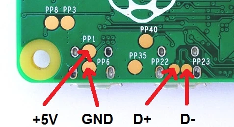

# V0 OLED & Switch Mount
This mod is for mounting a [Waveshare 1.3" OLED Pi Zero Hat](https://s.click.aliexpress.com/e/_A23Tz7) & 8x [6*6 ~4.2mm Tactile Switches](https://s.click.aliexpress.com/e/_9wvUAv) to skirts of a Voron V0. It also hides a [Pi Zero W](https://s.click.aliexpress.com/e/_AaYTdb) behind the OLED so you can save space in the rear and the bottom chamber. (Don't use with OctoPrint, Mainsail works fine)

A version without the switches (just the OLED) also exists.

## Instructions

0. You can find instructions for the switches [in the V2.4 Skirt Buttons readme.](../V2.4_Skirt_Buttons)
1. Insert the M3 inserts. Mount the skirts in place.
2. On the Pi Zero, solder wires to highlighted pads. This is for powering the Pi and connecting to the MCU.
	
3. Mount the Pi Zero in the skirts, using M2.5 standoffs as screws. Make sure the USB connectors face the bottom side.
4. Put the OLED Hat on, screw it in with M2.5 screws.
5. Put the button covers in the front cover, mount it with M3 screws.
6. [Enable Pi MCU for Klipper](https://github.com/KevinOConnor/klipper/blob/master/docs/RPi_microcontroller.md)
7. Use "sudo raspi-config" and under "Interfacing Options" enable SPI.
8. Add these to Printer.cfg 
	> [display] 
	> lcd_type: sh1106 
	> contrast: 236 
	> vcomh: 0 
	> x_offset: 0 
	> invert:FALSE 
	> cs_pin: pi:None 
	> dc_pin: pi:gpio24 
	> reset_pin: pi:gpio25
	> click_pin: pi:gpio20 
	> back_pin: pi:gpio21 
	> up_pin: pi:gpio6 
	> down_pin: pi:gpio19 
	> kill_pin: pi:gpio16
9. Change as needed. [Pinouts of the hat](https://www.waveshare.com/w/upload/4/46/1.3inch_OLED_HAT_User_Manual_EN.pdf)

FYI I don't think they are needed for our use, but since I already have them I can't verify so if you have trouble install [these](https://www.waveshare.com/wiki/Libraries_Installation_for_RPi) too.

### Icons used
 https://www.iconfinder.com/iconsets/arrows-elements-outline
 License: https://creativecommons.org/licenses/by/3.0/
### OLED Hat Front Cover & Button Covers Modded From
https://github.com/PiSugar/pisugar-case-pihat-cap/tree/master/1.3inch_oled_cap
License: https://github.com/PiSugar/pisugar-case-pihat-cap/blob/master/LICENSE
