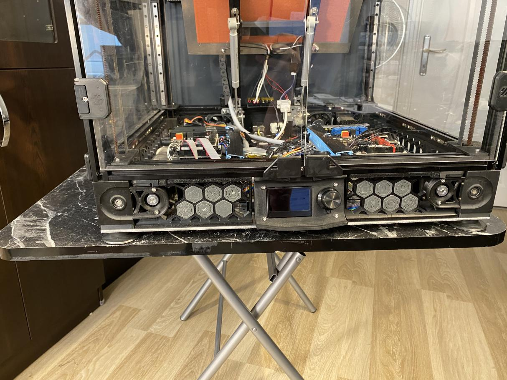
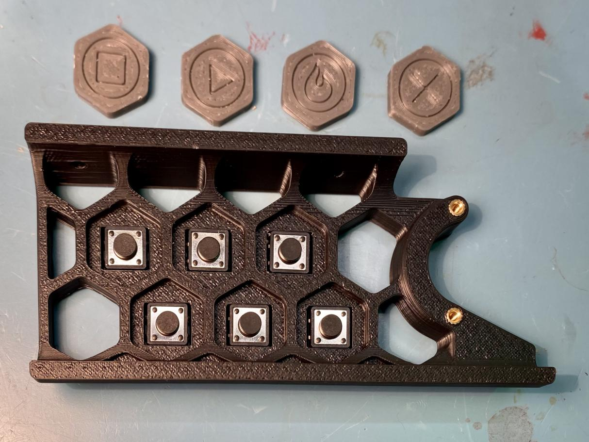
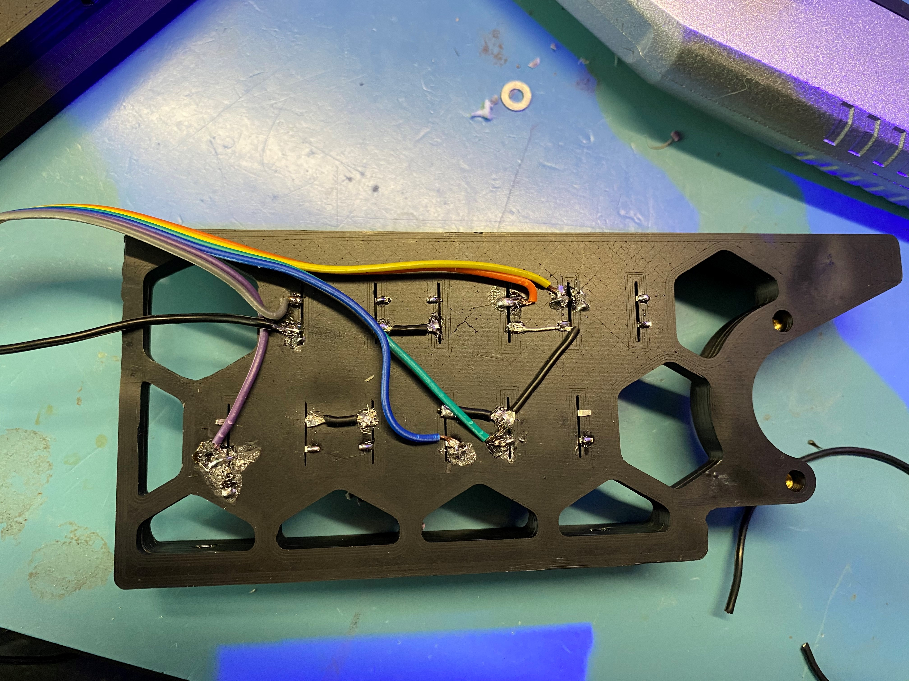
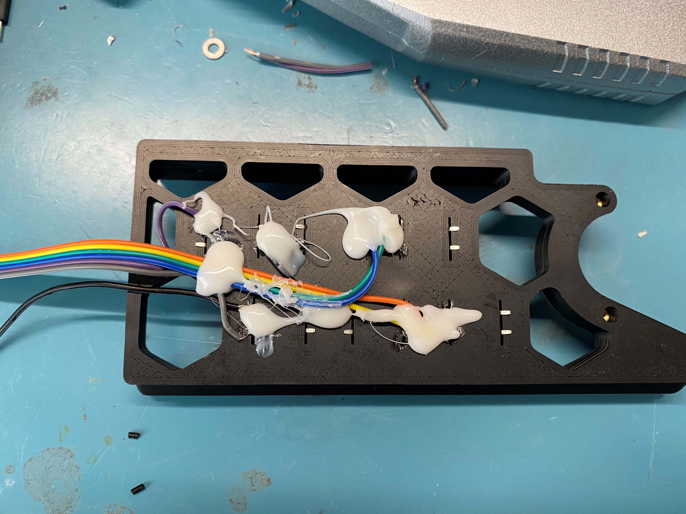

# Voron V2.4 Skirt Buttons Mod

## Switches Needed
|Printer Size| Qty Needed |
|--|--|
| 350 | 12 |
| 300 | 8 |
| 250 | 4 |

You need 12*12mm 5mm tactile switches. Make sure they are through hole, not SMD! Here are a few examples:
Amazon: https://amzn.to/3788dfZ
Aliexpress: https://s.click.aliexpress.com/e/_eKCJlo

## Wiring
Put the switches in the hexagons, bend the legs of the switches.

Wire one side of the switches together, connect to the mcu or Pi (depending on your config)

I recommend using hot glue to keep the wires in place. Otherwise you may disconnect the solder joints, or worse, break the legs of the switches when installing by accident.

## Gluing The Buttons
I recommend using hot glue for attaching the printed button caps to the switches. You can also use super glue, but you may need to space the caps by putting a washer in between as hot glue is thicker.

You may need to cut the elephant foot if the buttons get stuck when pressed.

## Config Options
You have 2 choices: Using FW of your 3D printer (like Klipper), or using Octoprint's Enclosure plugin.

### Config for Klipper
Here is the relevant config info from [GitHub page of Klipper](https://github.com/KevinOConnor/klipper/blob/master/config/example-extras.cfg).

    # Execute gcode when a button is pressed or released (or when a pin
    # changes state). You can check the state of the button by using
    # QUERY_BUTTON button=my_gcode_button
    #[gcode_button my_gcode_button]
    #pin:
    # The pin on which the button is connected. This parameter must be
    # provided.
    #press_gcode:
    # A list of G-Code commands to execute when the button is pressed.
    # G-Code templates are supported. This parameter must be provided.
    #release_gcode:
    # A list of G-Code commands to execute when the button is released.
    # G-Code templates are supported. The default is to not run any
    # commands on a button release.

### Config for Octoprint
1. Install the plugin "Enclosure Plugin"
2. Configure based on the info on this page: https://github.com/vitormhenrique/OctoPrint-Enclosure

## Icons used
 https://www.iconfinder.com/iconsets/arrows-elements-outline
 Licensed under: https://creativecommons.org/licenses/by/3.0/