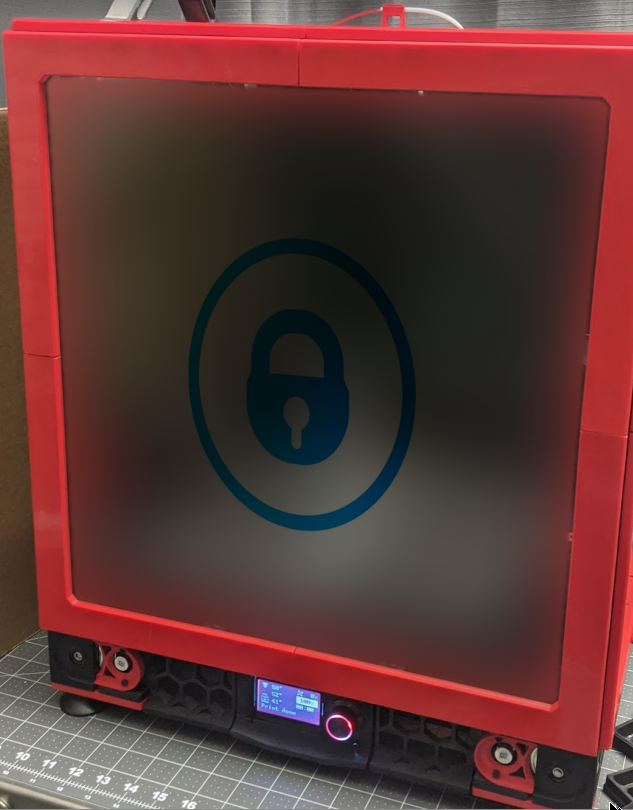
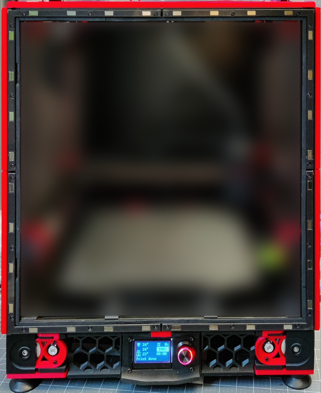

# **Voron 2.4 300 Front Magnet Panel Mounting System**

Mounting system for attaching a panel to the Voron 2.4 frame using magnets, primarily intended for the front panel.

###### BOM:

1. Magnets (quantity 64 (get a few spares), ~$25): https://www.kjmagnetics.com/proddetail.asp?prod=B442
2. Heat set inserts (quantity 24, ~$19): https://smile.amazon.com/gp/product/B077CJV3Z9
3. M3 T-nuts (quantity 24 ~$12), with a centered threaded hole, I used the type I could roll into the frame: https://us.misumi-ec.com/vona2/detail/110302247910/?HissuCode=HNTAJ5-3&PNSearch=HNTAJ5-3&searchFlow=results2type&KWSearch=HNTAJ5-3
4. M3 x.5mm x 6mm button head screws (quantity 48, ~$4.8): https://www.boltdepot.com/Product-Details.aspx?product=13334
5. 3mm panel (quantity 1, ~$17), I like polycarbonate panels for ease of drilling. I would suggest having it cut short by about 5mm on height and width of the Voron BOM panel size. This will avoid issues with tolerance attaching/removing the panel. The panels can not exceed the standard Voron BOM panel size, if they do, they will not fit into the area inside the rail magnet mounts.
6. 1/4 inch wide x 1/8th inch thick closed cell foam (qty 1, $10). This can be adhered to the panel or to the frame and will create an airtight seal of the panel to the frame when the magnets of the outer panel cover pull towards the magnets on the rail mounts. https://smile.amazon.com/gp/product/B08MTXJBR5
  
Approximate total BOM cost: $90

###### Instructions

STL files are for the 300 size 2.4 build. In the Fusion 360 file, the design was created using parametric modeling and has a lot of predefined parameters that you can adjust to fit to your needs.

If you use different size magnets or heat set inserts you'll want to adjust the parameters for those dimensions.

The design is two parts, the magnet rail mounts which attach to the extrusion and hosts one set of magnets. 
The outer part are the panel covers which contain the remaining set of magnets and attach to the panel using M3 screws. The drill guide is used to help align the holes to be drilled into the clear panel, it is very difficult to get accurate holes without these due to the variability in the panel tolerances.

STL file naming: TR - top right, TL - top left, BR - bottom right, BL - bottom left

1. Install T-nuts into the extrusion. Screw in the printed magnet rail mounts into the t-nuts using the M3 x 6mm screws. 
2. Install magnets into printed magnet rail mount recessed holes. They are sized to be somewhat of a tight press fit but if you find press fit is not sufficient, you can also super glue them in place.
3. For the printed panel covers, install the heat set inserts into the round holes.
4. If you haven't already, install the foam gasket onto the extrusion that is visible from within the bounds of the magnet rail mount. This is what the panel will press into to make a seal.
5. Install the magnets into the panel covers, you can also super glue them in place.
6. Align the clear panel so that it is centered onto the gasket, if you cut your panels 5mm smaller as recommended this should leave a couple mm buffer all around the edges of the panel. Take 3 of your L shaped panel covers, and use them to hold the panel in place while leaving 1 corner exposed.  
7. For the exposed corner, align the drill guide so that it lines up with the magnets. Using 2-3 spare magnets, place them into the guide to hold the guide in place. Drill out the holes in the panel using the drill guide holes and a 1/8" bit. Do this for the 3 remaining corners. The TR drill guide also works for the BL. The TL drill guide also works for the BR
8. Attach the panel to the covers with the M3 x 6mm screws, fastening into the previously embedded heat set inserts in the panel covers.

###### To-Do/Improvements

1. Reduce strain/potential for cracking on the panel (more important for acrylic I think) by designing a screw plate for the panels that will live on the opposite side of the panel inside the enclosure to spread out compression force of the screws.
2. The panel covers have a gap behind them to allow removal with fingers but handles could also be useful.
3. Create 250 and 350 versions of the STL files
  