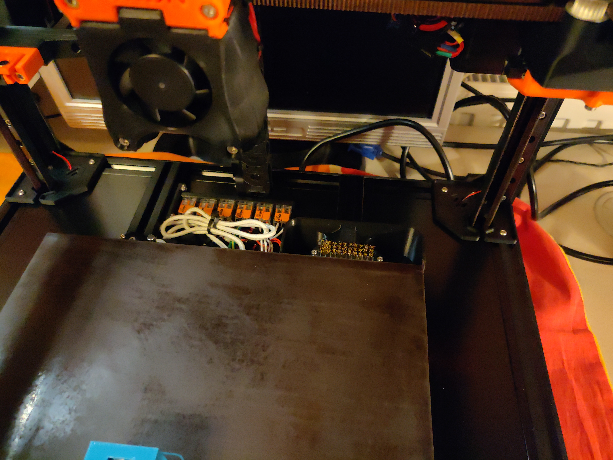
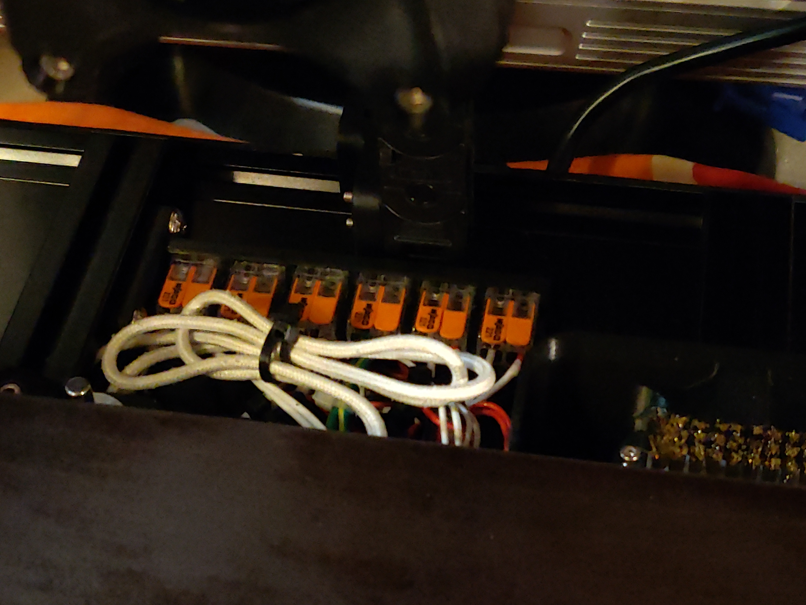
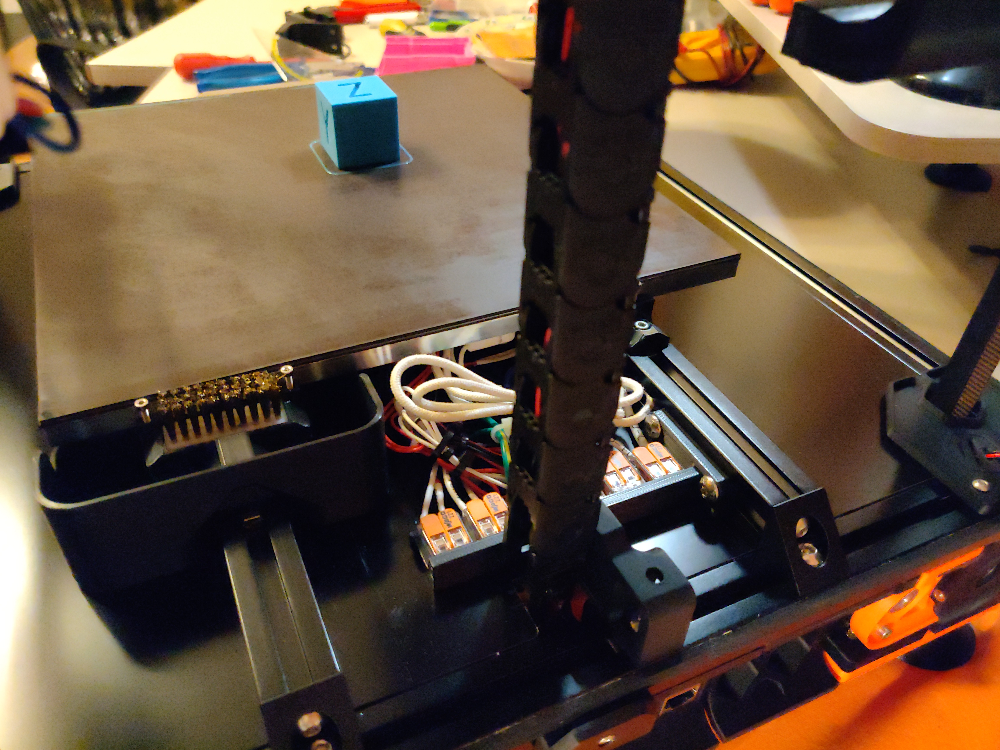
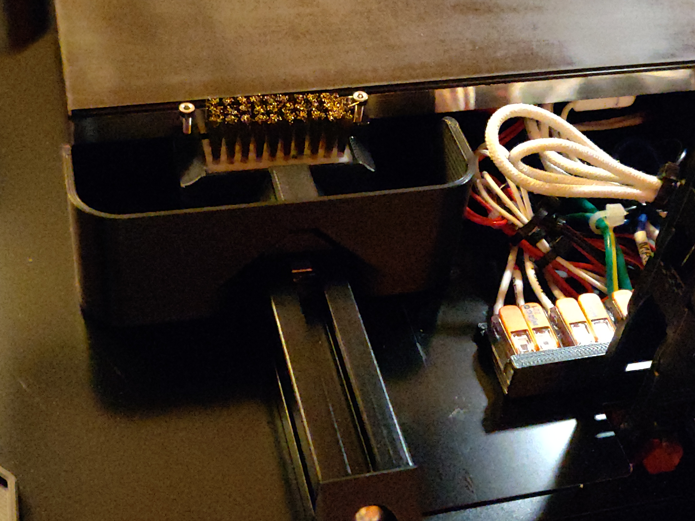

# Bed Wago & Klicky Compatible Purge Bucket for Voron 2.4 250mm
I am Building my first Voron, a 2.4 250mm and wanted to install / integrate the [Klicky Probe](https://github.com/jlas1/Klicky-Probe) with [Auto Z Calibration](https://github.com/protoloft/klipper_z_calibration) Script.

But since I also installed the [Bed Wago Mount Mod](https://github.com/xenon2008/VoronUsers/tree/master/printer_mods/deepfriedheroin/v2_bed_wagos), I didn't have enough space for the [Purge Bucket.](https://github.com/xenon2008/VoronUsers/tree/master/printer_mods/edwardyeeks/Decontaminator_Purge_Bucket_&_Nozzle_Scrubber)
In addition, when the Klicky holder was installed (on the left side of the gantry), the X Carriage always brushed against the holder for the Klicky probe when the nozzle was cleaned.
There is simply not enough space in a 250 2.4 Voron ...

So I tried with my limited Fusion 360 knowledge to adapt the Wago Mount and the Purge Bucket so that you can mount these two things on the right rear bed profile together
The Z end stop moves then to the left rear profile. 

The Klicky Probe Holder can now be attached to the left side of the Gantry and the Nozzle can be cleaned without the X Carriage always bumping into the Holder of the Klicky.
Because the Z end stop moves from the right to the left rear Profile, you can also Z Home without the Klicky holder being in the way. 

In principle, I have reduced the size of the wago holder for the Bed Wagos, and this is only screwed on to one side and no longer on both.
But which is more than sufficient ;) 

For the Purge Bucket i have reduced the size on the inside of the Profiles by a few mm so that it can still be easily removed and reinserted.

## Summary:

 1. Z Endstop moves from right to left Bed Profil
 2. Print & Install the Bed Wago Mount with the smaller one from here
 3. Print & Install the few mm smaller one (on one side only) Purge
    Bucket on the right Bed Profile
     
***Please do not forget to adjust the Z endstop position and the position of the purge bucket in the config !!!***

***Note:***
This is one of my first Fusion 360 "Mods"and also my first Github Upload.
So please forgive me for any beginner mistakes.
Also my English skills are not the best, and I hope everyone understands what I'm talking about ;)

*And since pictures say more than 1000 words, I have uploaded pictures for Illustration:*

