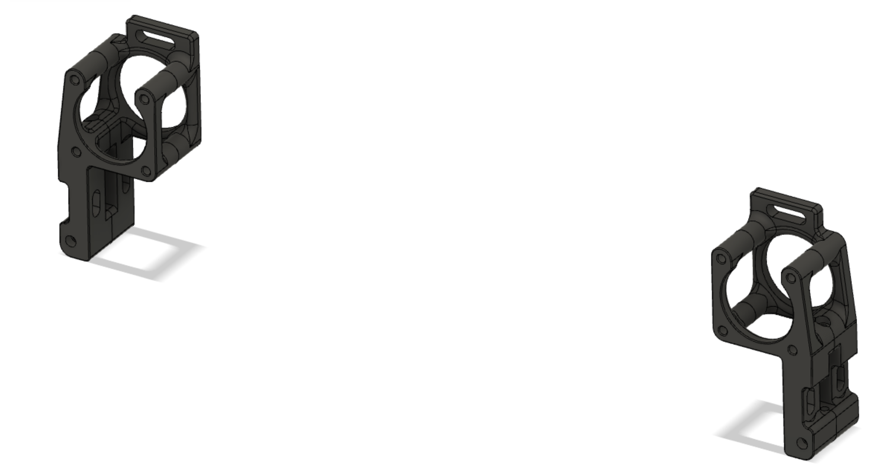
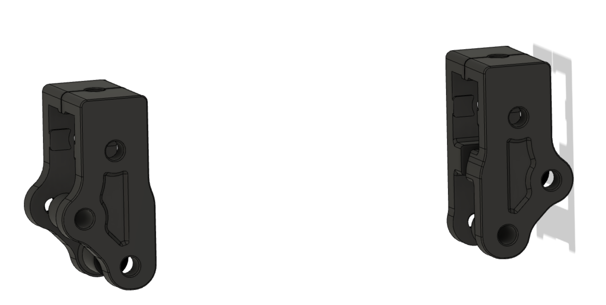
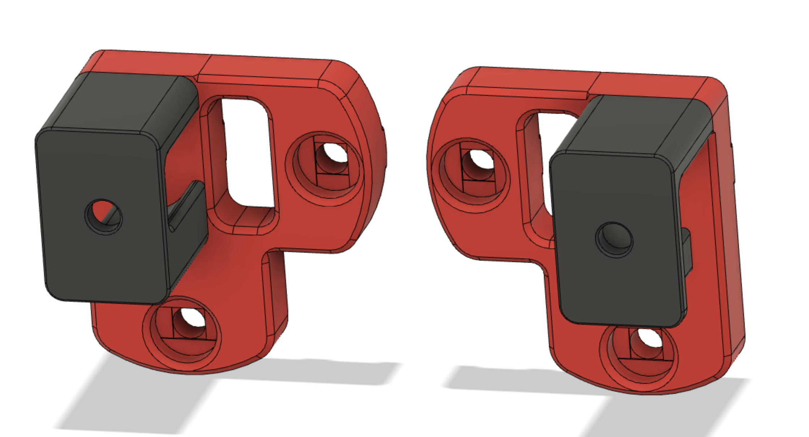

# More robust Voron Switchwire belt routing

This mod was created because the original stock parts didn't work well for me. 
The major part are the moded stepper cages. The stepper cages got tilted usually 
during tensioning and leading to the axle of the stepper not being parallel 
with the horizontal plane, which lead to yawning of the belt and increased wear 
and tear of the belt. Additionaly, the cages parts a and b had the tendency 
to open up in the bottom,  especially when the tensioning screw is one or two mm too long.

The modded version has a through-screw in the bottom and additional screw slot
on the top to attach it to the vertical extrusion, to help with proper leveling
of the stepper axle. You'd probably be able to address these issues without
if you were careful and knew about them. Using this design is just much faster.

##Additional mods##
The **xz blocks** have a slot for M5 button head screw that can be used to fix
tilting of the blocks w.r.t. the plane defined by the X gantry extrusion.
The original blocks have already some measures to prevent this, but apparently
those were not sufficient in my case (I was worried about tightening the screws
too much, as the plastic already started to give and yet there was still a bit of
tilting play). 

The **upper xz** blocks/supports were modded just to help more carefuly define
in what position and orientation the blocks should stay. These have the least effect, IMO.

With these, I had printed almost 400 hours without any belt-related issues and 
the belts look still fresh, no signs of fraying.
There exist also similar unofficial mods on Voron discord addressing similar issues
but I think this is the most exhaustive version.

## Print Instructions

**Print Settings:** Standard Voron PIF sttings -- at least 40 percent infill, 4 perims, 5 solid layers top and bottom

**Quantities: **Quantities are noted in the filenames -- each part needs to be printed only in single copy.

## Installation

Pop in the nut and slide in.  Most parts will align to the extrusion edges or auto-align from a corner.

The sizing is designed to hold them in place, but to make it easy to adjust the position with your fingernail or an allen wrench.

### Overal BOM

