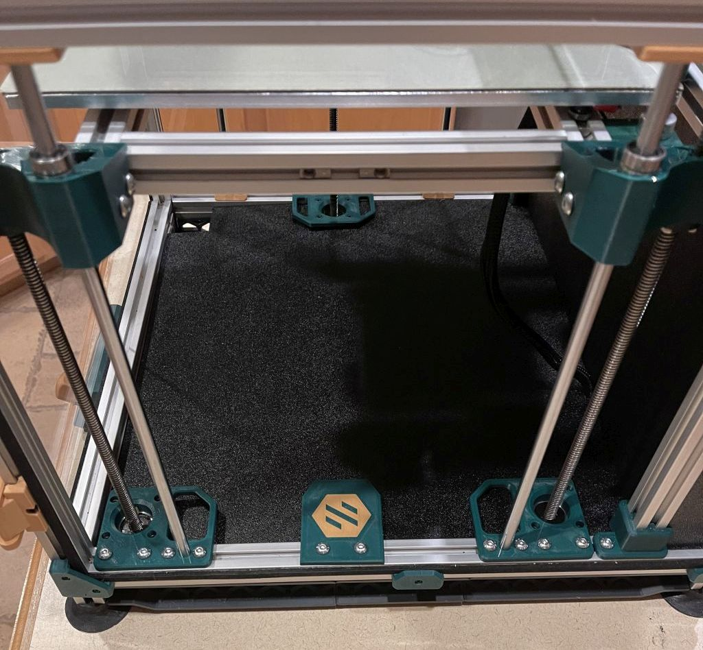
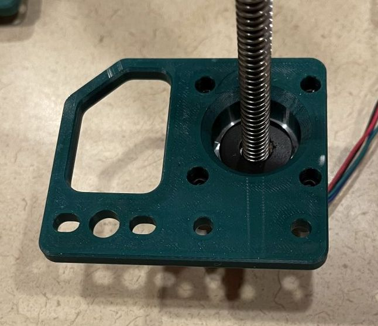
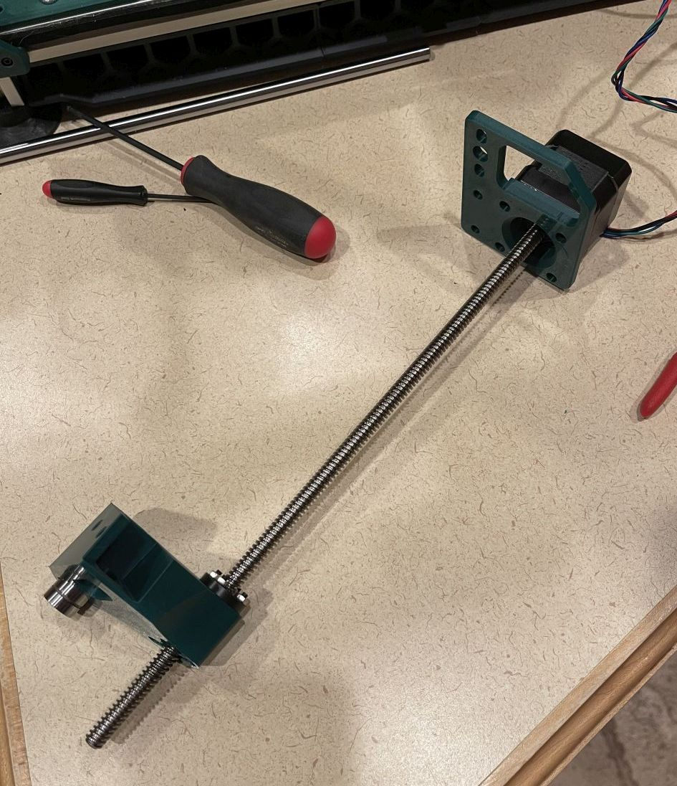
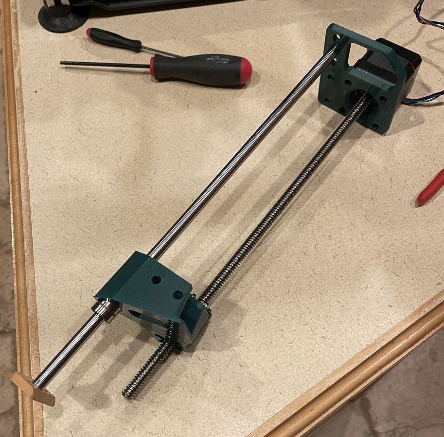
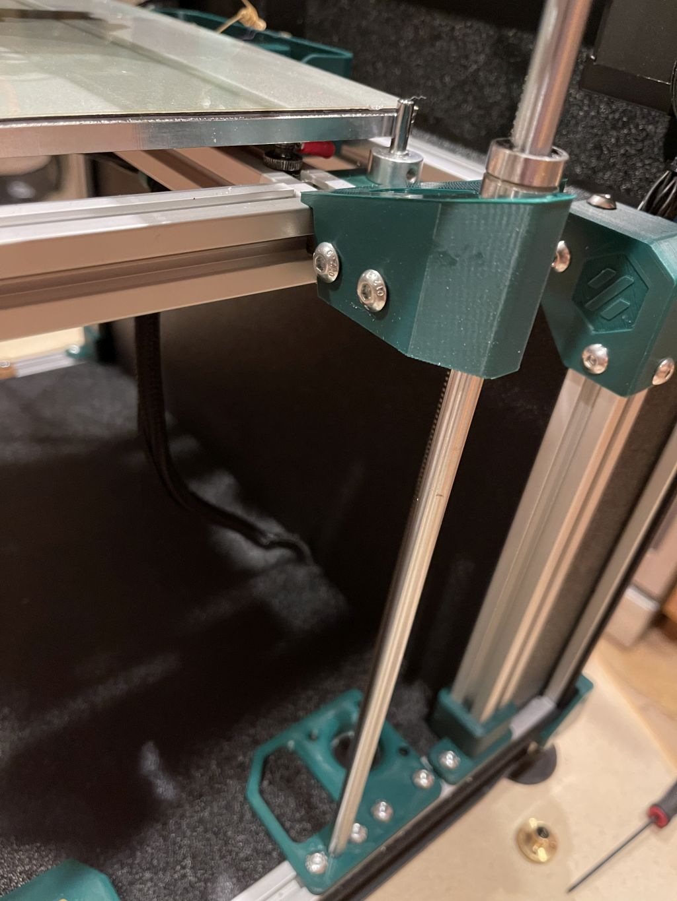
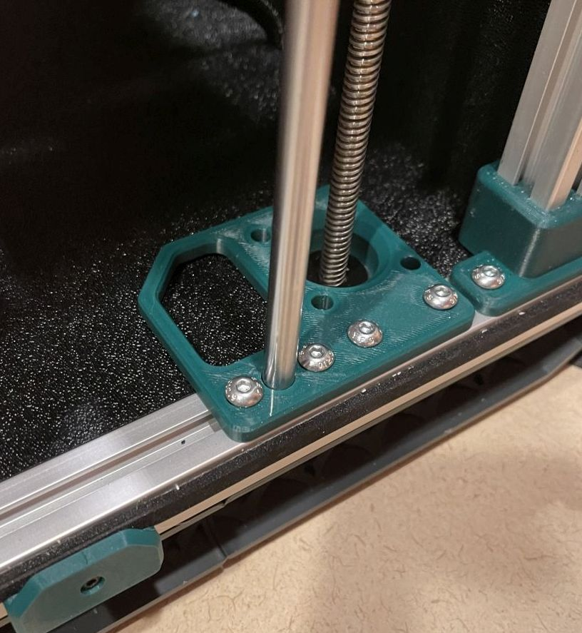
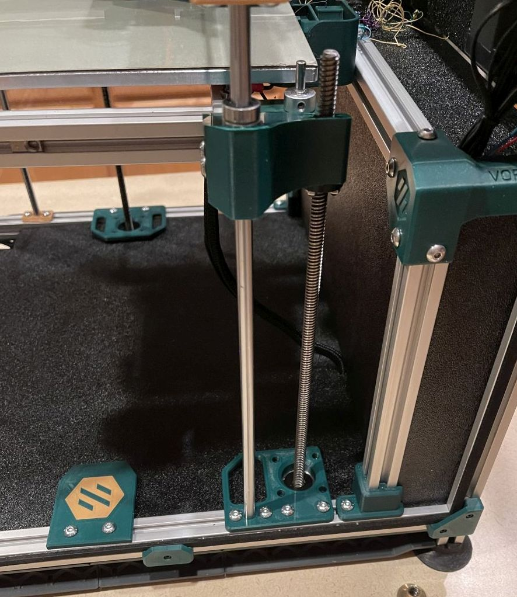
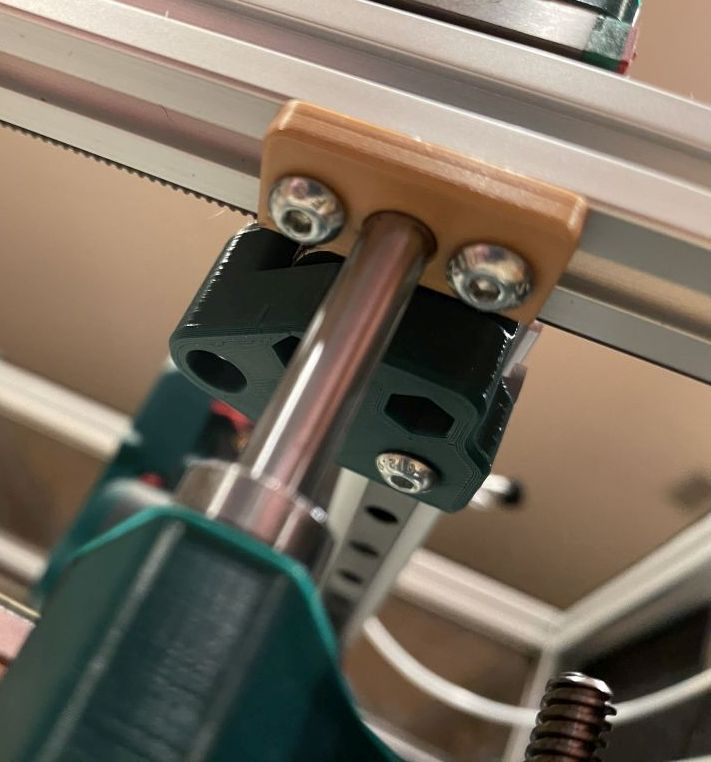

# Intro

This is a 3z mod for the V1 printer which utilizes the original hardware as much as possible to make this a simple upgrade for your printer. It will require an additional stepper and leadscrew to match your current setup, as well as a controller board with capability to drive an extra channel.

This has been tested with an BTT MOT-EXP board on a BTT SKR 1.4 as an inexpensive alternative to a complete board swap.

**NOTE:** DXF files have been provided with updated motor locations, however the 250 DXF has not been verified. It should be correct but please verify the measurements if you have a 250 build

&nbsp; 
## BOM:

* Additional leadscrew stepper 
* Controller capable of running 6 steppers
* 4 M5 roll-in Nuts
* 4 M5x10 BHCS

&nbsp; 
## Installation instructions:

Step | Image
--- | --------------------------------
| Remove deck panel | 
| Remove both rods from one side of the printer (leave motor and leadscrew in place for now as support for the bed) |
| Remove existing bed mounts | 
| Remove LM8LUU bearings from the mounts| 
| Install LM8LUU bearings into the new bed mounts |
| Install stepper motor into front motor mount printed part| 
| Install new bed mount on to the stepper shaft, secure leadscrew nut into bottom of mount | 
| Insert rod into bearing |
| Install Z Shaft Retainer on top of rod | 
| Remove M5 roll-in nuts used for bed mounts from bed extrusions and re-mount them on the opposite side (the inner side of the bed) |
| Insert front motor assembly into printer, attach to the bed and bottom extrusions |
| Attach Z shaft retainer to top extrusion|
| Remove existing Z motor assembly from printer and dissasemble|
| Repeat above directions for rear motor mount|
| Cut holes in deck plate to accomodate new motor locations (reference DXF if needed)|
| Install deck plate|
| Install deck plate cutout cover printed part|
| Update printer.cfg with new Z_TILT_ADJUST positions from the example configs|
| Follow normal procedures to align rods and leadscrews|

The provided configuration files assume that the Z1 motor is in the front right and the Z2 motor is in the rear right. If you wire them differently you will need to change the positions in the Z_TILT_ADJUST configuration to match.

&nbsp; 
## Notes:

The first several times you run Z_TILT_ADJUST klipper may run into homing timeouts or other issues as it tries to level the bed. Once the bed is fairly level it resolves much quicker and without warnings or errors.
&nbsp; 
&nbsp; 
##  Other Pictures

