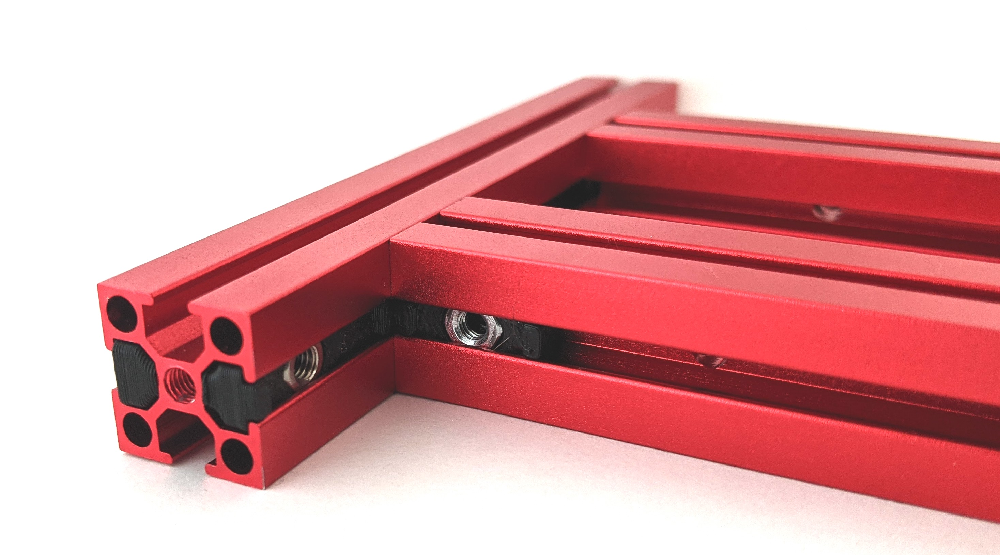
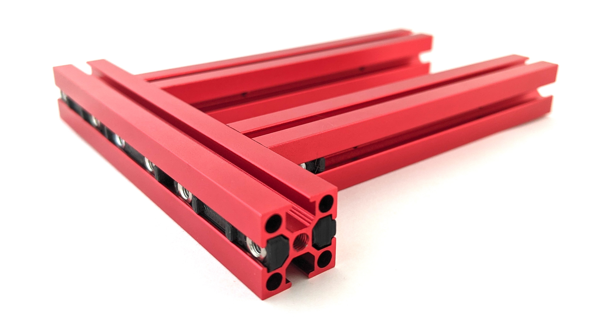
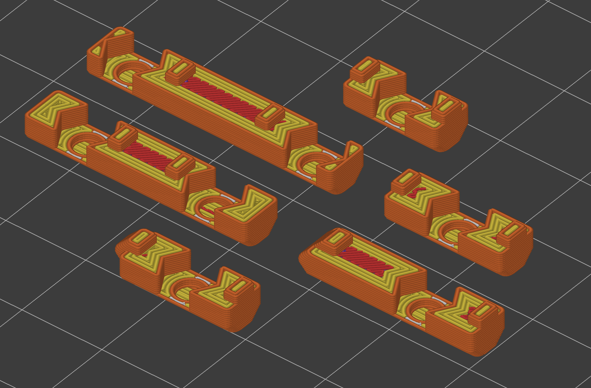
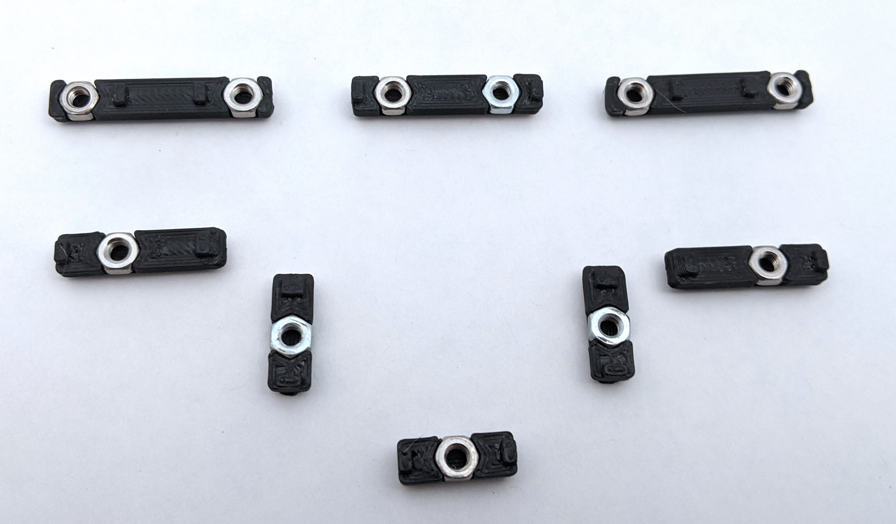

# V0 No-Drop Nuts (LDO frames only)

After struggling for hours to build the V0 bed assembly (which requires aligning 4 nuts simultaneously!), I had to do something.

This mod is a whole family of printable inserts to **hold your V0 nuts in place**, inside the extrusions, and even automatically do the alignment for specific locations.

They fit larger LDO extrusions, but not MakerBeamXL or OpenBeam (yet).

This will make your V0 build go happier, **guaranteed**, especially for the bed, panel mounts, door latch and mid panel.

Why?  They:
- hold nuts in place, so you don't need realign, push, or even rotate the printer around
- automatically align nuts for specific locations on the V0 bed
- make it easy to align nuts in a row, like for the AB drives, since the 15mm spacing stack matches those

No-Drop Nuts in place:

No-Drop nuts in the rear side of the bed:

With these, you can completely assemble a v0 bed assembly in a few minutes.

In general, once you align any nut, you won't have to realign it ever, unless inserting additional nuts.

The 15mm and 12mm versions are generic; use the 12mm for the front idlers on the V0, where the 15mm doesn't quite fit.

## Print Instructions

**Print Settings:** 3 perims, 0.4mm-0.5mm extrusion width, 0% infill, 3 top layers, 5 bottom layers.  Align the seam to rear edge.  Print as oriented; extrusion-channel-side down.  No overhangs past 45 degrees, so should be an easy print.

And you can print these really, really fast.  Who's going to see them, anyway?

BTW, you could probably remove most of the material and still have them align and work fine.  This didn't seem like a priority, since they each take maybe 90s to print.

**Quantities:** Quantities are noted for the specific nut locations for a V0.  Use 2x of the 12mm for the front idlers.  You'll need 24x for the enclosure sides, plus plenty for the skirts, mid panels, rails, and other spots.

## Installation

Pop in the nut and slide in.  Most parts will align to the extrusion edges or auto-align from a corner.

The sizing is designed to hold them in place, but to make it easy to adjust the position with your fingernail or an allen wrench.

### V0.0 Bed-Assembly-specific NoDropNuts

Look carefully, as the picture shows exactly which nuts go where; ones with angled corners fit next to each other on corners.  For the V0.0 bed, the filenames correspond to locations, matching this picture.
- top left and top right: NoDropNut_Rear_Ext_Rear_Edge_x2.stl
- top center: NoDropNut_Rear_Ext_Rear_Center_x1.stl
- left and right middle, with angled corners: NoDropNut_Rear_Ext_Front_x2.stl
- left and right lower, with angled corners: NoDropNut_Side_Ext_Side_x2.stl

NoDropNut_12mm.stl go in the front idlers, and NoDropNut_15mm.stl is your go-anywhere one, to print in sheets.

## Design notes

Designed in Fusion 360.

The parts files have 0.1mm of designed-in clearance inside the extrusion in each direction, and they intentionally hold the nut tight, so that the ends bend a bit, to provide a tight slip fit in the extrusion channel.

## Credits

Big thanks to `grantr` for testing an earlier version, called 'SteadyNuts'.
