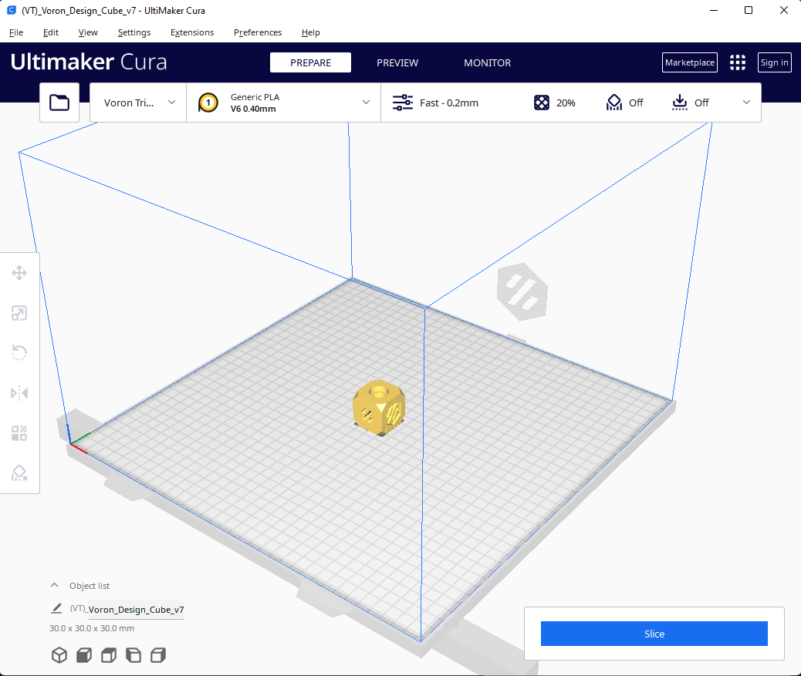
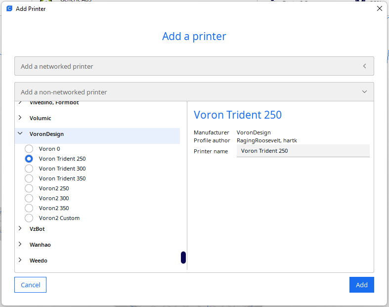
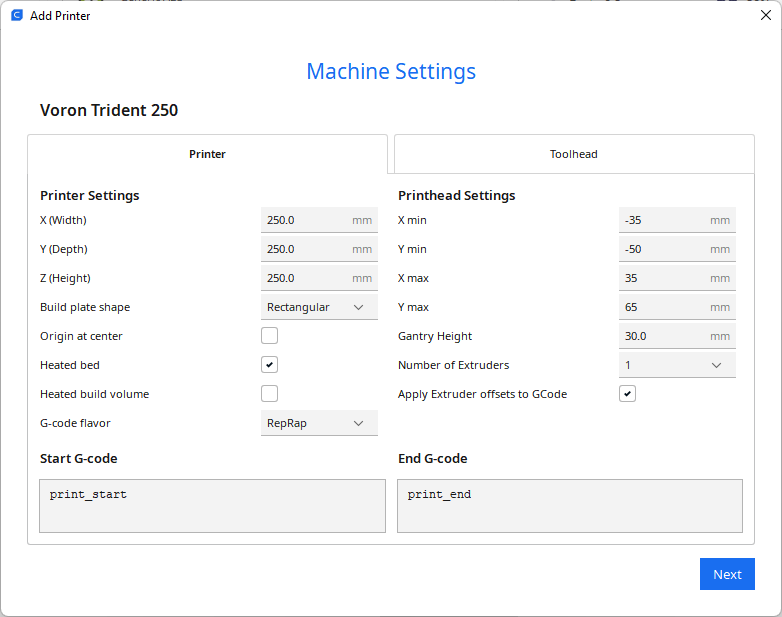
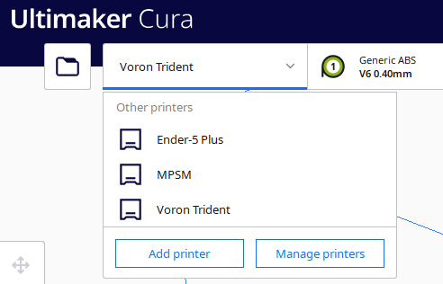

# Voron Trident Cura Configuration

Setup instructions for Cura and the Voron Trident / 1.8.



These instructions were tested on Windows 11 and Cura 5.3a, they should also work on MacOS/Linux.

## Copy Configuration Folder

Find the Cura `Configuration Folder`:

1. Open Cura.
2. Navigate to `Help` -> `Show Configuration Folder` (Help menu in Windows, may be located elsewhere for other operating systems)
3. The Configuration Folder will open in your file manager

* On Linux, the configuration folder is usually: `~/.config/cura/{cura_version}/`.
* On Windows, the configuration folder is usually: `%appdata%/cura/{cura_version}/`

Simply copy the contents cura-config-folder from this repository into the path above.

*NOTE*: These steps will need to be performed again for each new version of Cura you install.

## Adding Your Printer
Creates an instance of your printer in Cura.

Note, the Configuration Folder step above must be done before proceeding with the steps below.

Add your printer to Cura:
 1. In the file menu, `Settings -> Printer -> Add Printer...`.
 2. Select, `A non-networked printer -> VoronDesign -> VORON Trident XXX` (where `XXX` matches your printer size).
 3. Type a unique `Printer name` in the text box on the right.
 4. Click the `Add` button.
 5. Set the `G-code flavor` dropdown to `Marlin`
 6. Set your Start G-Code to `print_start` which is a macro that you should have defined in your kliper config files.
 6. Set your End G-Code to `print_end` which is a macro that you should have defined in your kliper config files.
 7. Modify any settings, the defaults should be fine.
 8. Click the `Next` button.
 9. You should see your pinter in the dropdown.

Screenshots:

 <br />
 <br />
 <br />

## Printer Definition
Basic information for the Trident family of pritners is defined in:

`./cura_config_folder/definitions/voron_trident_base.def.json`

Variations for each size of the trident are defined in:

* `./cura_config_folder/definitions/voron_trident_250.def.json`
* `./cura_config_folder/definitions/voron_trident_300.def.json`
* `./cura_config_folder/definitions/voron_trident_350.def.json`

## Print Platform 3D Model
The 3D model is defined in:

* `./cura_config_folder/meshes/voron_trident_250mm_bed_model.stl`
* `./cura_config_folder/meshes/voron_trident_300mm_bed_model.stl`
* `./cura_config_folder/meshes/voron_trident_350mm_bed_model.stl`

The STLs were built with CadQuery using the script `./bed_mesh_source/voron_trident_bed.py`

The STL model is inspired by [hartk1213's][hartk_vt_350].

[hartk_vt_350]: https://github.com/hartk1213/MISC/blob/f5b1685f1d56b7e2ab853a98741ae614131b116c/Voron%20Mods/SuperSlicer/Bed_Models/Trident/VT_350mm_bed_model.stl

## Toolhead Definitions
A set toolheads with various nozzle sizes (each definition file above needs its own toolhead definitions):
* `voron_trident_250_0.40.inst.cfg`
* `voron_trident_250_0.60.inst.cfg`
* `voron_trident_250_0.80.inst.cfg`
* `voron_trident_300_0.40.inst.cfg`
* `voron_trident_300_0.60.inst.cfg`
* `voron_trident_300_0.80.inst.cfg`
* `voron_trident_350_0.40.inst.cfg`
* `voron_trident_350_0.60.inst.cfg`
* `voron_trident_350_0.80.inst.cfg`


It is recommended to copy all toolheads, even if your printer only has one nozzle size available.

These files can be easily modified if your extruder has unique sizing/requirements.

Here is an example:
```
[general]
name = V6 0.40mm
version = 4
definition = voron_trident_250

[metadata]
setting_version = 16
type = variant
hardware_type = nozzle

[values]
machine_nozzle_size = 0.4
```


## References
These setting are based on the following sources:
 - https://github.com/Ultimaker/Cura/blob/master/resources/definitions/voron2_base.def.json
 - https://github.com/Ultimaker/Cura/tree/master/resources/variants
 - Inspiration pulled from @jgehrig's V0 config