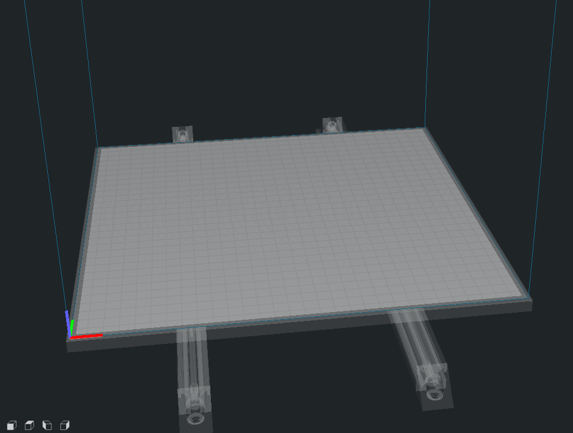

Here are bed models for adding to your Cura Printer Profiles.  

Includes bed .stl files for 250, 300, and 350mm builds.

Add the .stl file for your printer size to your "\resources\meshes\" Cura Folder.

In your "\resources\definitions\" Cura folder open your printer profile's .json file.
    Change the following line to match the .stl file of your choice:
    "platform": "voron2_300_bed.stl",

To use your own model the trick is to put 0,0,0 in the center of your bed model.