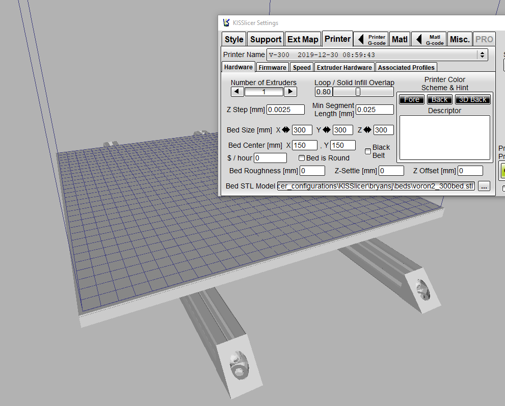

Here are bed models for adding to your KISSlicer Printer Profiles.  

Includes bed .stl files for 250, 300, and 350mm builds.  Add these under "Printer" "Bed STL Model".

To use your own model the trick is to put 0,0,0 in the front left of your bed model (match the slicer layout).