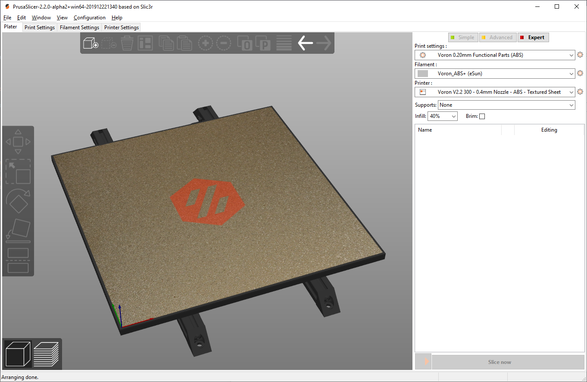

Here are bed models and textures for adding to your Prusaslicer Printer Profiles.  

Includes bed .stl files for 250, 300, and 350mm builds.  Add these under "Printer Settings" "Bed Shape".

Texture files can be used for all sizes.  Includes the Photoshop source file as well.

STEP files included for editing, but not needed for Prusaslicer.

To use your own model the trick is to put 0,0,0 in the center of your bed model.