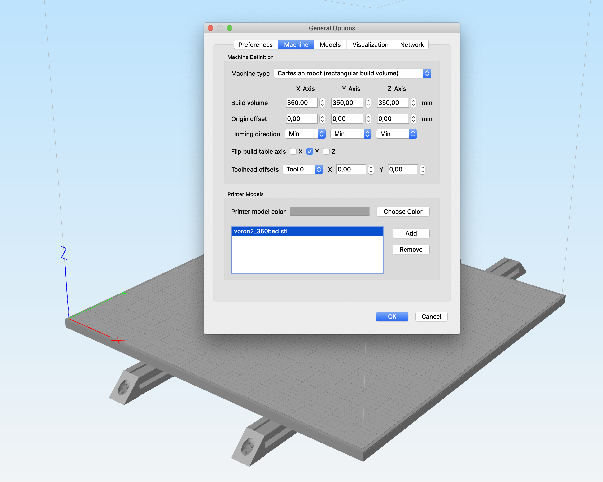

Here are bed models for adding to your Simplify3D Printer Profiles.
(This is a simple adoption of great work of bryansj)

Includes bed .stl files for 250, 300, and 350mm builds.  Add these under "General options" "Machine" "Printer".
