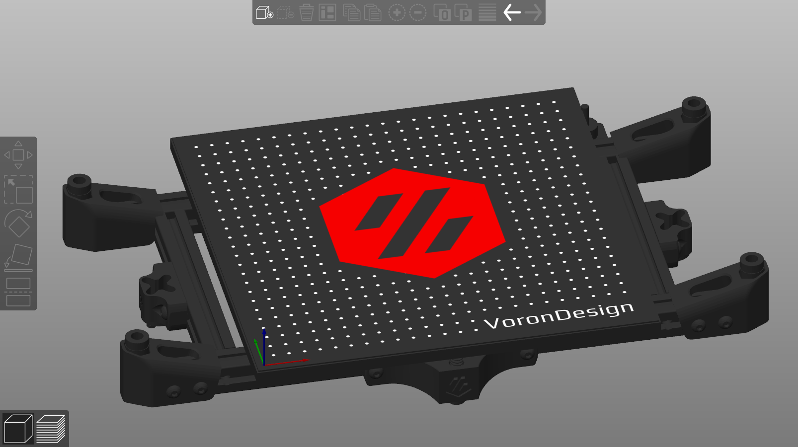

<b>Voron v1.8 bed STL for PrusaSlicer and SuperSlicer</b>
 

Download the appropriate STL for your bed size (250 or 300mm^2)

Import under Printer Settings > General > Bed Shape (Set ...) > Model (Load...)

Bed texture can be found under the filename <i>bedtexture-v2-250.png</i> which can be found in the SuperSlicer install directory.

Acknowledgements: Mjam#7653 on Discord for the 300mm^2 STL

